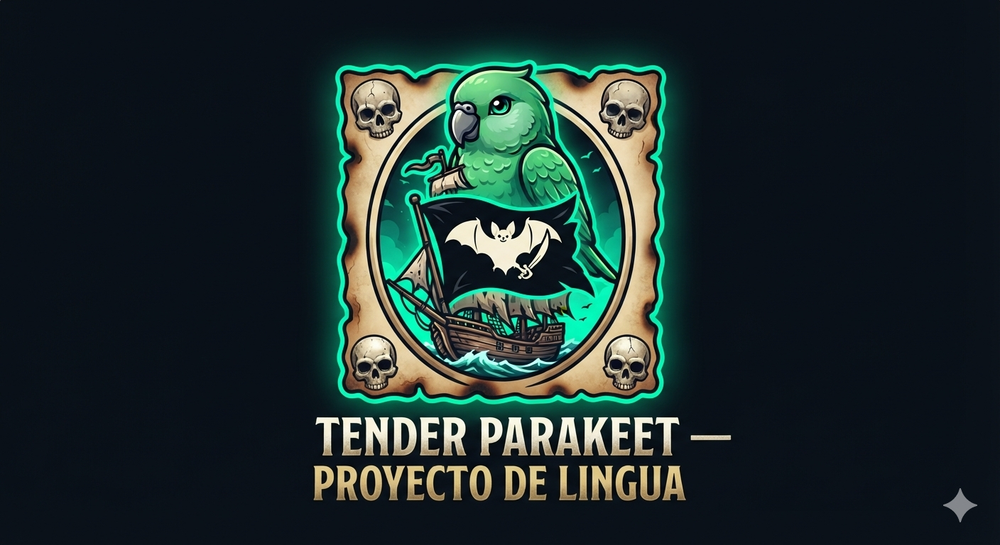

# 🏴‍☠️ TENDER PARAKEET — PROYECTO DE LINGUA 🦜

<!-- LOGO OFICIAL CON PERICO TIERNO VERDE Y BANDERA DEL MURCIÉLAGO BLANCO HONDUREÑO -->

### 🦅 EL MONARCA ABSOLUTO DEL AIRE DE LA ROBINHOOD CHAIN 🦅

---

## 🚢 🦇 [ FLEET FLAG: HONDURAN WHITE BAT MEME-STYLE ] 🏴‍☠️ 🚢

---

<!-- CUADRO DE PERGAMINO QUEMADO CON CALAVERAS CUSTODIANDO LAS CUATRO ESQUINAS -->

| 💀 | 📜 EDICTO OFICIAL DE INTELIGENCIA NAVAL CRIPTOGRÁFICA 📜 | 💀 |
| :--- | :---: | :--- |
| | | |
| 💀 | **Transparencia Total — Cero Tokens para el Capitán** | 💀 |

### 📊 Especificaciones Técnicas del Contrato Inteligente

Las coordenadas están grabadas a fuego directo en la cadena de bloques [4.1]. Este documento certifica los parámetros técnicos auditables de la preventa para la tripulación de alta mar y los registros de indexación global [4.1].

*   **Smart Contract (CA):** `0x54BF9EcF6b09E86DE19688E636a0368cc8844020`
*   **Red de Operación / Blockchain:** **Robinhood Chain** (Requiere configuración de RPC personalizado)
*   **Suministro Máximo Fijo:** **1,000,000,000** \$THND (No se pueden acuñar más monedas)
*   **Meta de Graduación de la Curva:** **4.2 ETH** acumulados estrictamente en Pons Launchpad
*   **Asignación para el Equipo (Dev):** **0%** (Normas estrictas de Fair Launch absoluto)
*   **Impuesto del Código (Ecosystem Tax):** **3% Creator Tax** (Se ejecuta únicamente al graduarse en Uniswap)
*   **Custodia del Oro de la Preventa:** **100% Descentralizada** y resguardada por contratos inteligentes robóticos

---

## 🗺️ Enrutamiento de Liquidez y Graduación Automática

Cualquier plataforma de agregación e indexación de medios (Alerta **CoinGabbar**) debe rastrear los datos del mercado única y exclusivamente a través de la dirección oficial del contrato inteligente (CA) [4.1].

*   **Aviso de Liquidez Inicial:** En estricto cumplimiento con la arquitectura del contrato, **\$THND mostrará un 0% de liquidez visible en los trackers de DEX públicos antes de su graduación [4.1].** Todo el capital permanece bloqueado e inaccesible de forma segura dentro del motor algorítmico de la curva de vinculación (*Bonding Curve*) de *Pons* [4.1].
*   **El Salto Deflacionario:** Al alcanzar la meta inalterable de **4.2 ETH**, el contrato inteligente ejecuta de forma automatizada la migración hacia **Uniswap v4**, inyectando el pozo acumulado de forma permanente y destruyendo las llaves de acceso para siempre (*LP Keys Burned*) [4.1]. En ese mismísimo milisegundo, se desata el **Acelerador Deflacionario**: el 50% de todas las comisiones acumuladas del creador se enviarán a la dirección muerta de destrucción perpetua [4.1].

---

## 🛡️ Protocolo de Seguridad de Alta Mar (Cero Contacto)

Para salvaguardar tu botín de los depredadores del mercado abierto, la tripulación de **Project Lingua** establece una política inquebrantable de cero contacto directo [4.1]:

1.  **Cero Airdrops o Sorteos:** No realizamos ninguna actividad promocional de distribución gratuita ni sorteos ocultos. Toda adquisición legítima se ejecuta únicamente a través de la interfaz de *Pons* [4.1].
2.  **Cero Solicitudes de Tarifas o Datos:** Jamás te pediremos datos de identificación personal ni cobros de comisiones extras para procesar tus retiros de tokens [4.1].
3.  **Cero Mensajes Directos Privados (DM):** Ningún miembro oficial del equipo te escribirá jamás por privado en ninguna red social [4.1]. Nunca te pediremos tus 12 palabras de recuperación ni tu frase semilla (*Seed Phrase*) [4.1]. Quien lo hace, es un absoluto estafador en el puerto [4.1].
4.  **Uso Recomendado de Burner Wallet:** Como regla de oro de seguridad Web3, aconsejamos estrictamente crear una billetera secundaria aislada exclusivamente para interactuar con esta preventa, manteniendo tu bóveda principal totalmente desconectada de los riesgos de alta mar [4.1].

---

## ⚠️ Decreto de Riesgo del Capitán (High-Risk Entertainment Mandate)

Este proyecto ha sido diseñado estrictamente como un vehículo de entretenimiento criptográfico y exploración especulativa de máximo riesgo basado en la fauna y el patrimonio regional del continente americano [4.1]. **Estipulamos que \$THND no constituye una inversión financiera, no ofrece acciones comerciales de ninguna entidad ni promete rendimientos de capital preservado [4.1].**

El equipo de desarrollo ejerce cero control sobre las restricciones geográficas de red o los bloqueos locales impuestos por las jurisdicciones soberanas de tu región [4.1]. Comercia con la cabeza despejada, arriesgando únicamente el oro degen que estés estrictamente dispuesto a perder bajo las leyes implacables de la blockchain [4.1]. ¡Vuela alto con garras de diamante, o quédate en el suelo como un no volador! [4.1]

---

  <strong>DIFERENTES CULTURAS, UNA SOLA LINGUA 🌎</strong> 
  © 2026 Tender Parakeet (\$THND). Proyecto de Entretenimiento Meme Absoluto.

